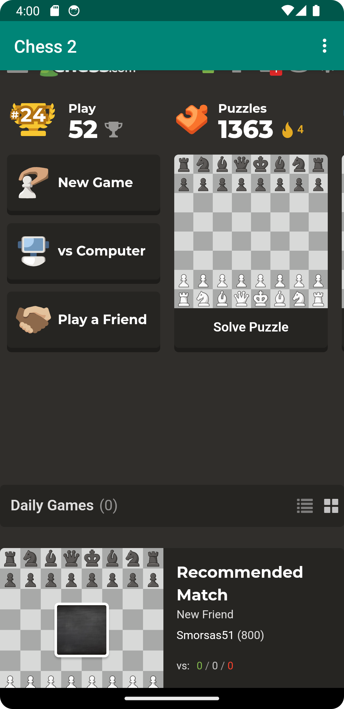
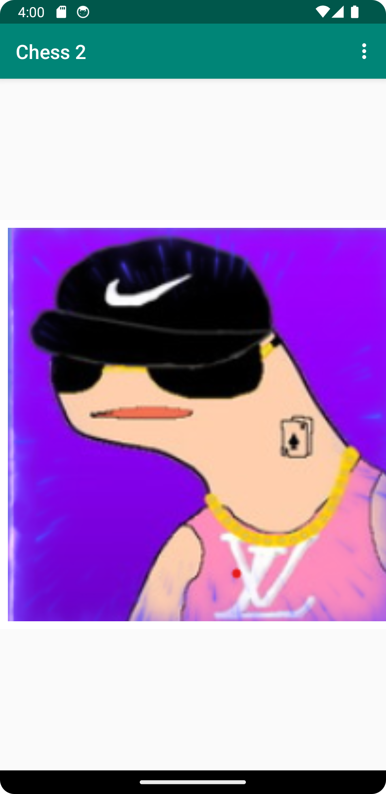

# Rapport
 
## Följande grundsyn gäller dugga-svar:

- Jag renamade app_name till chess 2 i strings.xml
- Jag la till en rad kod till AndroidManifest.xml för att aktivera internet access
```
    <uses-permission android:name="android.permission.INTERNET"/> 
```

- Jag ändrade textView blocket till WebView i activity_main.xml och la till raden nedan för att de den en ID
```
    android:id="@+id/my_webview"   
```
- I onCreate() instantierade jag WebView och activerade javascript execution
```
protected void onCreate(Bundle savedInstanceState) {
...
        myWebView = findViewById(R.id.my_webview);
        myWebView.setWebViewClient(new WebViewClient());
        myWebView.getSettings().setJavaScriptEnabled(true);
}
```
- Jag skapade en html fil och la till en bild i samma folder
- I html filen laddade jag bilden
```

```
- Jag la till load funktionen i showExternalWebPage (och internal)
```
    myWebView.loadUrl("https://www.chess.com/home");myWebView.loadUrl("https://www.chess.com/home");
    ...
    myWebView.loadUrl("file:///android_asset/about.html");
```
- Jag la till en call funktion för att ladda rätt websida
```
 public boolean onOptionsItemSelected(MenuItem item) {
 ...
    if (id == R.id.action_external_web) {
    ...
        showExternalWebPage();
    ...
    }
    if (id == R.id.action_external_web) {
    ...
        showInternalWebPage();
    ...
    }
 }
```
- Nedan är bilder från Internal och External WebView



